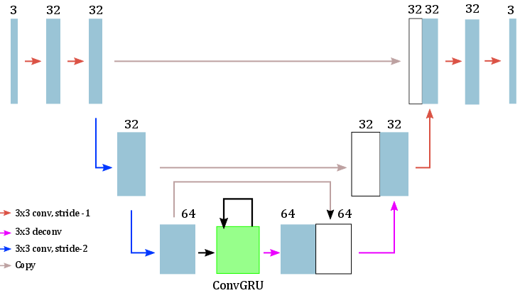
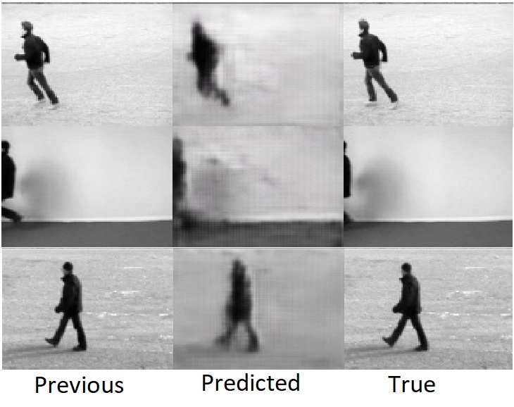
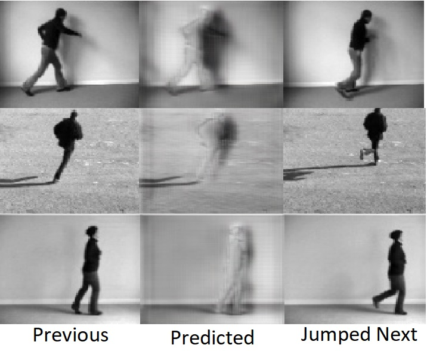

# Foresight-TensorFlow
Predicting future frames in videos using Convolutional GRU networks.

All our code uses **Python 3** and **TensorFlow**. If you plan to run this code you will also need **OpenCV, NumPy and SciPy**.

We propose a modification to the convolutional GRU architecture in [1] to perform prediction of future frames in human action videos. We introduce skip connections in the network similar to [2] and move away from the traditional use of squared error as loss function. We use a loss function we call Motion-Masked-Loss which penalizes incorrect pixel intensities in locations of high motion and penalizes less for background/non-moving areas. 

The architecture we use is given below. The numbers above each block represent number of channels. The ConvGRU layer has 128 channels.

## Results
We use the KTH action dataset for our experiments. Here are some results.

Without the Motion-Masked-Loss

With the Motion-Masked-Loss (here we try to predict the t+10th frame given first t frames)

## Observations
- The skip connections help to retain the local spatial information that is lost over the repeated convolution-pool blocks.
- Without the Motion-Masked-Loss, the model pays little attention to the actual movement as it constitutes only a small portion of the frames.
- The new loss helps focuss the attention of the model to the parts which matter.
- It is difficult for any model to avoid copying the last frame, especially when trying to predict the immediately next frame which is extremely similar to the previous frame. This motivates us to predict **Jumped Frames** instead, which are essentially 10 frames after last input frame.
- The model will initially copy the last frame, then slowly begin to learn the parts of the image that become un-occluded because of movement.
- We notice that the model is able to learn the portions of the image that become un-occluded because of movement and predicts the intensities at those locations with fair visual correctness, however, there is great difficulty in generating the moved objects in their new locations.

The reason that the model is not able to draw the objects at their moved position is because of how our current implementation of the loss is structured. Currently, we use a 0-1 mask approach where locations of no motion get penalized by 0 even if the prediction at that location is wrong, while postions of high motion get penalized heavily if the prediction there is wrong. Now, we calculate the locations of motion by taking a absolute sum of gradients with respect to time of the frames. However, we cannot take into account the final frame that is to be predicted in this calculation, this causes the model to associate a 0 loss in that new position giving the model very low motivation to actually learn what/where the new intensities should be. 

We believe shifting away from such a 0-1 mask mechanism to a smoother approach might fix things.

## References

1. Siam, Mennatullah, et al. "Convolutional Gated Recurrent Networks for Video Segmentation." arXiv preprint arXiv:1611.05435 (2016).
2. Ronneberger, Olaf, Philipp Fischer, and Thomas Brox. "U-net: Convolutional networks for biomedical image segmentation." International Conference on Medical Image Computing and Computer-Assisted Intervention. Springer, Cham, 2015.

